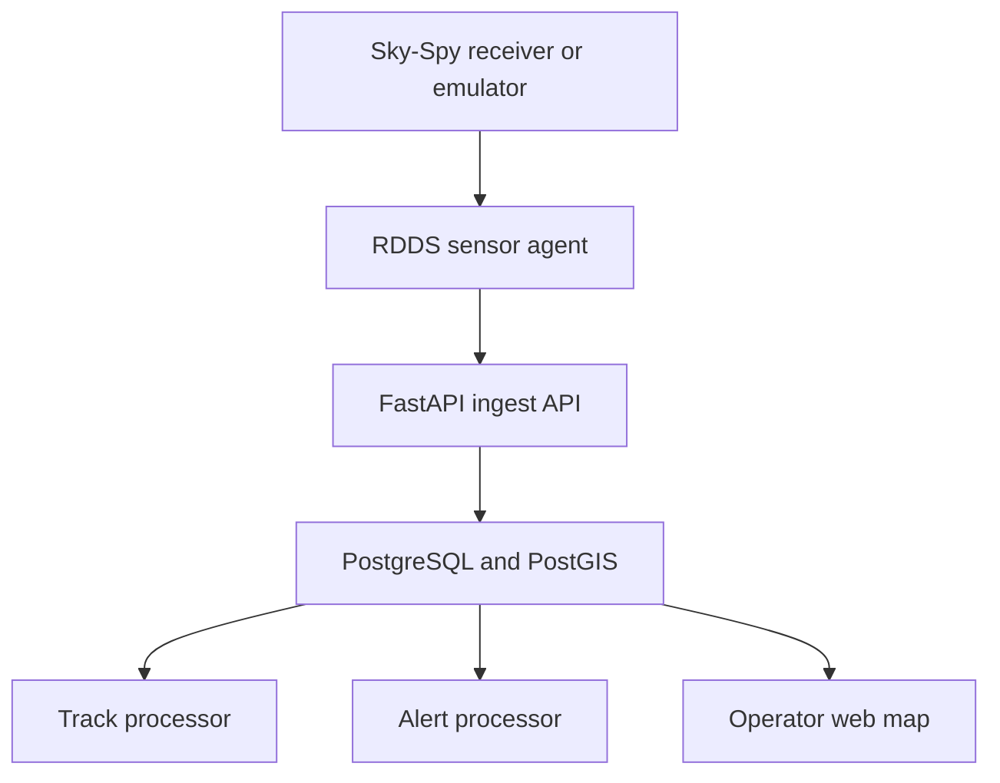

# RDDS

RDDS (Remote Drone Detection System) is a standalone system for receiving,
normalizing, storing and visualizing broadcast Remote ID detections. It extends
the open-source [Sky-Spy](https://github.com/colonelpanichacks/Sky-Spy)
receiver firmware with a durable field agent, a PostGIS backend, track
processing, protected zones, alerts and an operator web interface.

> Current development version: **0.20.0**. The complete software path is tested
> with emulators. Firmware builds for XIAO ESP32-S3 and XIAO ESP32-C5, but
> reception with physical hardware still requires validation.

TAK Server integration is intentionally not part of the current system. RDDS is
developed and operated as an independent service; a TAK adapter may be added in
a later stage.

## How it works



Sky-Spy passively receives Remote ID broadcasts over Bluetooth LE and Wi-Fi.
The sensor agent converts the serial JSON stream into the versioned `rdds/1.0`
ingest protocol, authenticates with an individual sensor token and sends data
to the API. If the network or API is unavailable, observations remain in a
local SQLite outbox and are replayed in order after connectivity returns.

PostGIS stores sensor, drone and pilot positions. Background processors combine
observations into tracks and compare active tracks with protected zones. The web
interface displays the resulting operational picture and provides audited
operator actions.

## Current capabilities

- newline-delimited Sky-Spy serial ingestion at 115200 baud;
- BLE, Wi-Fi NAN and Wi-Fi Beacon source identification;
- Basic ID, operator ID, drone and pilot position, altitude, height AGL, speed,
  heading, RSSI and Wi-Fi channel;
- per-sensor credentials, token rotation and sensor disable/enable controls;
- Argon2id operator accounts with server-side sessions, CSRF protection and roles;
- administrator session inventory, forced logout and separate security-event log;
- failed-login warnings with configurable observation window and threshold;
- durable offline queue with retry, replay and dead-letter storage;
- rate-limited offline replay with current observations processed first;
- sensor supervision that separates API, Sky-Spy source and queue health;
- per-boot source, parsing, outbox and API-delivery diagnostics with safe JSON export;
- rolling stream-quality checks for malformed input and frequent source reconnects;
- on-demand fleet health overview with operational sorting and 24-hour issue counts;
- online, degraded, offline and maintenance states with audited recovery;
- multi-sensor track correlation, separate detection sessions and track history;
- deduplicated 60-second live trails;
- protected zones with persistent incident snapshots and live presence status;
- alert acknowledgement, closure, timeline and controlled audible notification;
- sensor and zone editing, disabling and soft deletion;
- live Leaflet map with collapsible operational layers and panels;
- synthetic multi-sensor simulator and Sky-Spy serial emulator;
- controlled silent, malformed-stream and forced-disconnect emulator modes;
- enriched `skyspy/1.1` firmware output for ESP32-S3 and ESP32-C5;
- verified scheduled PostgreSQL backups with checksums and guarded restore;
- configurable data retention with a dry-run mode and maintenance history;
- optional TLS gateway for HTTPS access without exposing the API port directly;
- contextual loading indicators for audit, archives and track-history requests;
- administrator-only database size and configured-capacity monitoring.

Remote ID is broadcast data and does not by itself provide cryptographic proof
of a drone or operator identity. RDDS should be treated as a detection and
situational-awareness aid, not as the sole source for attribution or automated
enforcement decisions.

## Repository layout

| Path | Purpose |
| --- | --- |
| `src/` | primary XIAO ESP32-S3 Sky-Spy firmware |
| `xiao-c5-5g/` | ESP32-C5 dual-band firmware and ESP32-S3 compatibility build |
| `sensor-agent/` | serial adapter and durable SQLite delivery queue |
| `server/api/` | FastAPI ingest, management and query API |
| `database/` | initial PostGIS schema and ordered migrations |
| `server/api/app/tracker.py` | observation-to-track background processor |
| `server/api/app/alert_processor.py` | protected-zone alert processor |
| `web/` | operator interface served by Nginx |
| `simulator/` | synthetic multi-sensor RDDS protocol source |
| `skyspy-emulator/` | synthetic Sky-Spy serial JSON source |
| `protocol/` | machine-readable RDDS protocol schema |
| `operations/` | scheduled PostgreSQL backup and guarded restore tools |
| `gateway/` | optional Nginx TLS termination profile |
| `docs/` | stage documentation, examples and operating notes |

## Development deployment

### Requirements

- Linux host or VM; the reference environment uses Ubuntu 24.04;
- Docker Engine with Docker Compose;
- at least 2 vCPU, 4 GB RAM and approximately 50 GB of disk for development;
- Python 3 for local tests;
- PlatformIO Core only when compiling firmware.

### Configuration

Create the local environment file and restrict its permissions:

```bash
cd /opt/rdds/source
umask 077
cp .env.example .env
nano .env
```

Replace every `CHANGE_ME...` value with an independent random secret. The
`.env` file and sensor tokens must never be committed, pasted into issue logs or
included in screenshots.

### Start the core services

```bash
cd /opt/rdds/source
sudo docker compose up -d --build
sudo docker compose ps -a
```

On a new installation, create the first administrator interactively:

```bash
sudo docker compose run --rm api \
  python -m app.bootstrap_admin \
  --username admin \
  --display-name "RDDS Administrator"
```

Default development endpoints:

- operator interface: `http://SERVER_IP:8080`;
- API and OpenAPI documentation from the VM: `http://127.0.0.1:8000/docs`;
- readiness probe from the VM: `http://127.0.0.1:8000/api/v1/health/ready`.

Verify the API locally:

```bash
curl -fsS http://127.0.0.1:8000/ | python3 -m json.tool
curl -fsS http://127.0.0.1:8000/api/v1/health/ready \
  | python3 -m json.tool
```

The direct HTTP bindings are intended for a controlled development network.
Use a reverse proxy, TLS and appropriate network filtering before exposing RDDS
outside that environment.

Stage 13 adds scheduled backup and disabled-by-default retention services to the
normal Compose stack. Before the first start, create the backup directory named
by `RDDS_BACKUP_PATH` and ensure that `RDDS_OPERATIONS_UID/GID` can write it.
See `docs/RDDS_STAGE13.md` before enabling retention or restoring a backup.

## Run without receiver hardware

The general simulator creates several receivers observing moving synthetic
drones:

```bash
sudo docker compose --profile simulation up -d --build
```

The Sky-Spy emulation profile validates the exact serial-adapter path. First
register `skyspy-sensor-01` in the operator interface and place its one-time
individual token in the ignored `.env` file as
`RDDS_AGENT_SENSOR_TOKEN`.

```bash
sudo docker compose --profile skyspy-emulation up -d --build
sudo docker compose logs -f skyspy-emulator sensor-agent-emulator
```

Stop following logs with `Ctrl+C`. Do not run the hardware and emulated
Sky-Spy agents simultaneously with the same sensor ID.

## Tests

Parser, queue and delivery tests do not require Docker or hardware:

```bash
python3 -m unittest discover -s sensor-agent/tests -v
PYTHONPATH=server/api python3 -m unittest discover -s server/api/tests -v
sh operations/tests/test_operations.sh
python3 -m py_compile sensor-agent/rdds_agent.py skyspy-emulator/main.py
git diff --check
```

The expected result is thirteen passing sensor-agent unit tests.

## Firmware builds

Create an isolated PlatformIO environment:

```bash
python3 -m venv .venv
. .venv/bin/activate
python -m pip install --upgrade pip
python -m pip install "platformio==6.1.19"
```

Compile all supported environments without flashing a board:

```bash
pio run -e seeed_xiao_esp32s3
pio run -d xiao-c5-5g -e seeed_xiao_esp32s3
pio run -d xiao-c5-5g -e seeed_xiao_esp32c5
```

Generated `.pio/` directories and the `.venv/` environment are ignored by Git.
Uploading and validating RF reception should wait until the matching physical
receiver is connected.

## Documentation and versions

Each completed implementation stage has a corresponding file in `docs/` and an
annotated Git tag:

| Range | Main result |
| --- | --- |
| `rdds-v0.1.0`–`rdds-v0.4.0` | API, protocol, simulator, tracks and live map |
| `rdds-v0.5.0`–`rdds-v0.7.0` | zones, alerts, operator controls and audit log |
| `rdds-v0.8.0` | sensor provisioning and individual credentials |
| `rdds-v0.9.0` | durable Sky-Spy sensor agent |
| `rdds-v0.10.0` | operator workspace and entity lifecycle |
| `rdds-v0.11.0` | enriched Sky-Spy firmware output |
| `rdds-v0.11.1` | web proxy DNS refresh hotfix |
| `rdds-v0.12.0` | operator accounts, sessions, CSRF protection and role-based access |
| `rdds-v0.13.0` | backup, guarded restore, retention and optional TLS gateway |
| `rdds-v0.13.1` | live-data priority, separate track sessions and 60-second trails |
| `rdds-v0.14.0` | loading feedback and administrator database capacity monitoring |
| `rdds-v0.15.0` | operator session control and centralized security-event log |
| `rdds-v0.16.0` | zone incident snapshots, presence timeline and audible alerts |
| `rdds-v0.17.0` | sensor health supervision and maintenance mode |
| `rdds-v0.18.0` | sensor-path diagnostics, safe telemetry export and emulator fault modes |
| `rdds-v0.18.1` | higher-contrast light theme and map-to-sensor sidebar navigation |
| `rdds-v0.19.0` | automatic Sky-Spy stream-quality supervision and history |
| `rdds-v0.20.0` | fleet-wide sensor health overview and map navigation |

Start with:

- `docs/protocol/RDDS_PROTOCOL_V1.md` for the ingest contract;
- `docs/RDDS_STAGE9.md` for the field agent and offline queue;
- `docs/RDDS_STAGE10.md` for the operator workspace;
- `docs/RDDS_STAGE12.md` for accounts, login, sessions and roles;
- `docs/RDDS_STAGE13.md` for backup, restore, retention and HTTPS;
- `docs/RDDS_STAGE13_1.md` for replay throttling and track-session behavior;
- `docs/RDDS_STAGE18.md` for sensor diagnostics and controlled fault tests;
- `docs/RDDS_STAGE19.md` for automatic stream-quality supervision;
- `docs/RDDS_STAGE20.md` for the fleet-wide sensor health overview;
- `docs/RDDS_STAGE14.md` for loading states and storage-budget monitoring;
- `docs/RDDS_STAGE15.md` for operator sessions and security-event monitoring;
- `docs/RDDS_STAGE16.md` for zone incident awareness and audible alerts;
- `docs/RDDS_STAGE11.md` for firmware fields and compilation.

## Planned work

- validation with physical ESP32-S3 and ESP32-C5 receivers;
- validation of backup restore drills on a separate host;
- optional central identity integration;
- controlled external notification and integration outputs;
- optional TAK Server integration as a separate future adapter.

The project does not implement radio interference, takeover or countermeasure
functions.
